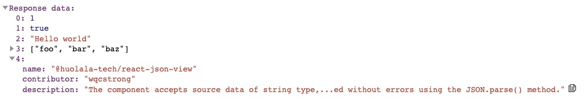

## @huolala-tech/json-node-view

`<JsonNodeView />` is a React component for display JSON data.

This package accepts source data of *string* type, which means you need to ensure that the data passed in is valid JSON string and can be parsed without errors using the `JSON.parse()` method. Otherwise, the data will be converted to a *string* type before being processed.

## Install

```bash
# Yarn
yarn add @huolala-tech/json-node-view

# NPM
npm install @huolala-tech/json-node-view

# pnpm
pnpm install @huolala-tech/json-node-view
```

## Usage

```tsx
imoprt React from 'react';
import ReactDOM from 'react-dom';

import JsonNodeView from '@huolala-tech/json-node-view';
import '@huolala-tech/json-node-view/dist/style.css';

const data = JSON.stringify([
  1,
  true,
  "Hello world",
  ["foo", "bar", "baz"],
  {
    name: "@huolala-tech/json-node-view",
    contributor: "wqcstrong",
    description: 'This package accepts source data of *string* type, which means you need to ensure that the data passed in is valid JSON string and can be parsed without errors using the `JSON.parse()` method.',
  },
]);

const App = () => {
  return (
    <div id="app">
      <JsonNodeView
        source={data}
        keyCount={200}
        defaultExpand={false}
        maxTitleSize={100}
      />
    </div>
  );
};

ReactDOM.render(
  <React.StrictMode>
    <App />
  </React.StrictMode>,
  document.getElementById('root') as HTMLElement
)
```

Now you should get that after above:



## Config

The default configuration usage:

```tsx
<JsonNodeView
  source={data}
  rootLabel=""
  defaultExpand={false}
  keyCount={200}
  maxTitleSize={100}
/>
```


| Name            | Type              | Default value | Description                                                  |
| --------------- | ----------------- | ------------- | ------------------------------------------------------------ |
| `source`        | `string`          | None          | Origin json string.                                          |
| `rootLabel`     | `React.ReactNode` | `""`          | Root node's label.                                           |
| `defaultExpand` | `boolean`         | `false`       | Whether expand property panel.                               |
| `keyCount`      | `number | "all"`  | `200`         | `JsonNodeView` supports lazily loading more properties. The parameter indicates how many properties to show at a time, and you can pass `"all"` to show all properties. |
| `maxTitleSize`  | `number`          | `100`         | The max length of abbreviated title in collapse.             |


## License

[MIT](https://opensource.org/licenses/MIT)
